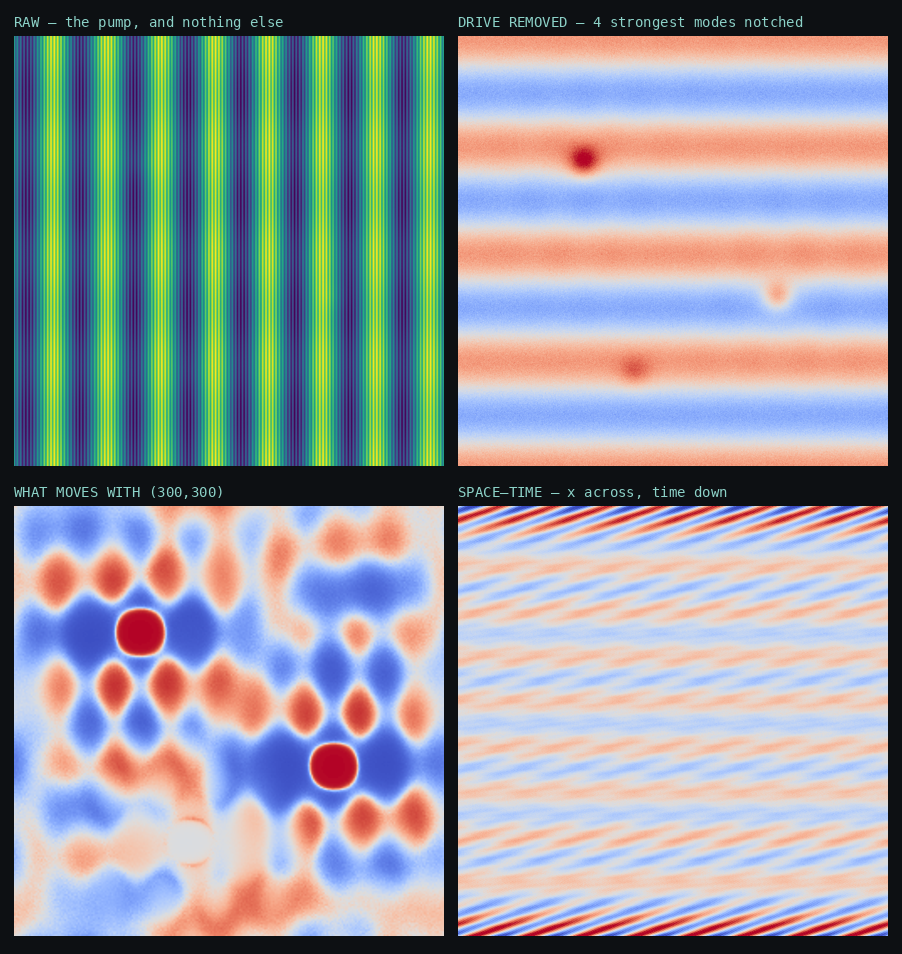
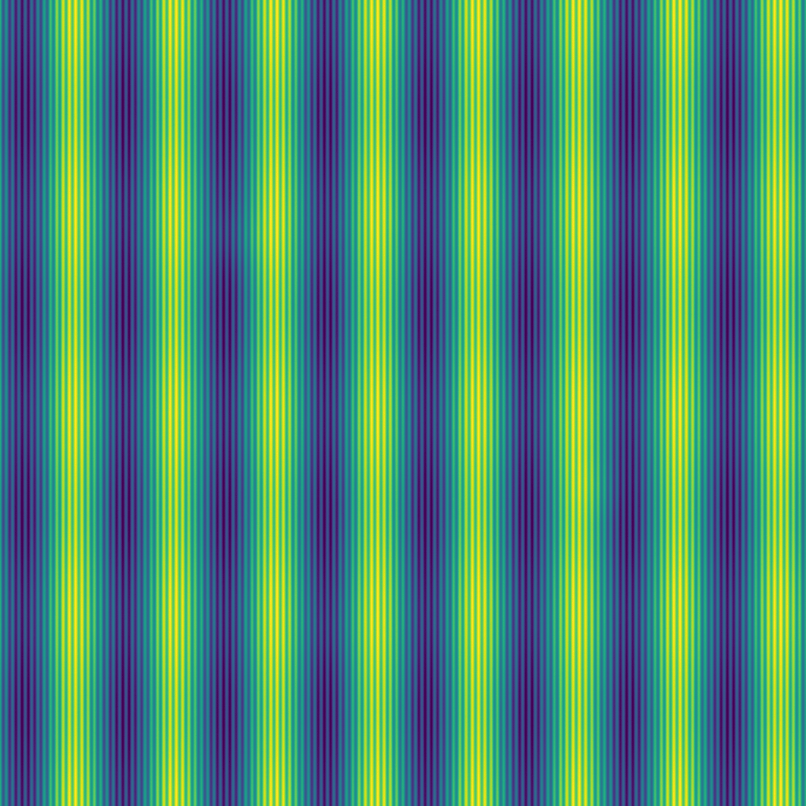
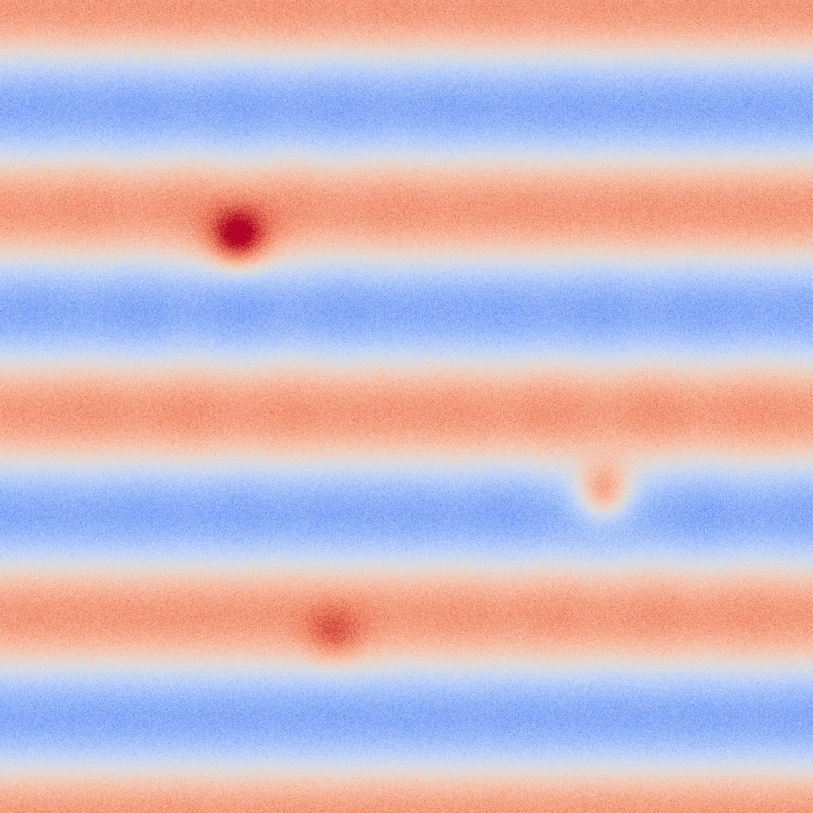
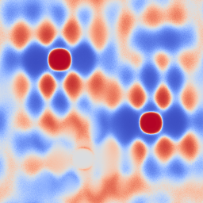
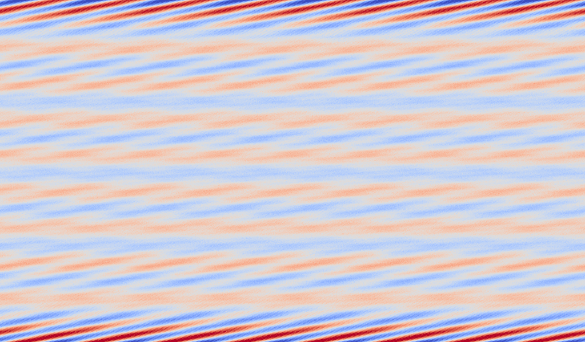
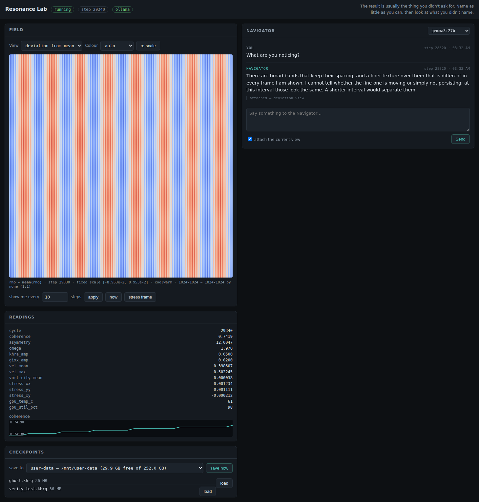
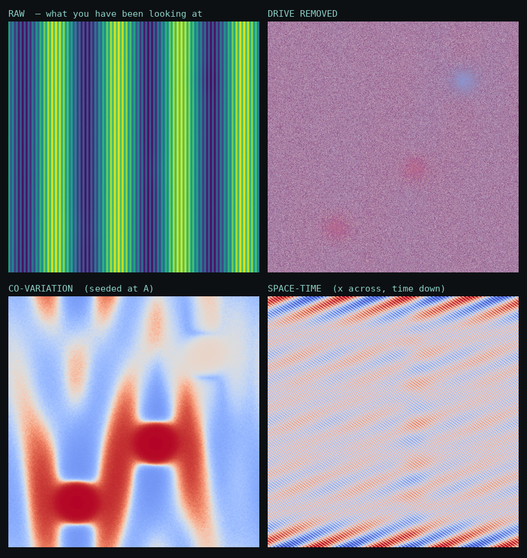

# Gallery

> These came from `lab/tools/mock_daemon.py`, not from a real lattice. The mock
> carries three hidden structures, two sharing a slow signal and one independent,
> so the co-variation view can be checked against a known answer rather than
> admired.

One field, four views — raw, drive removed, co-variation, space–time.

Raw density at 1024². The forcing, and nothing else.

Same instant with the strongest modes notched — three structures appear.

Seeded at (300,300). Its partner lights up; the independent structure does not.

One row of the lattice stacked over cycles.

The working interface.

Controlled test on a synthetic field with a known answer.
